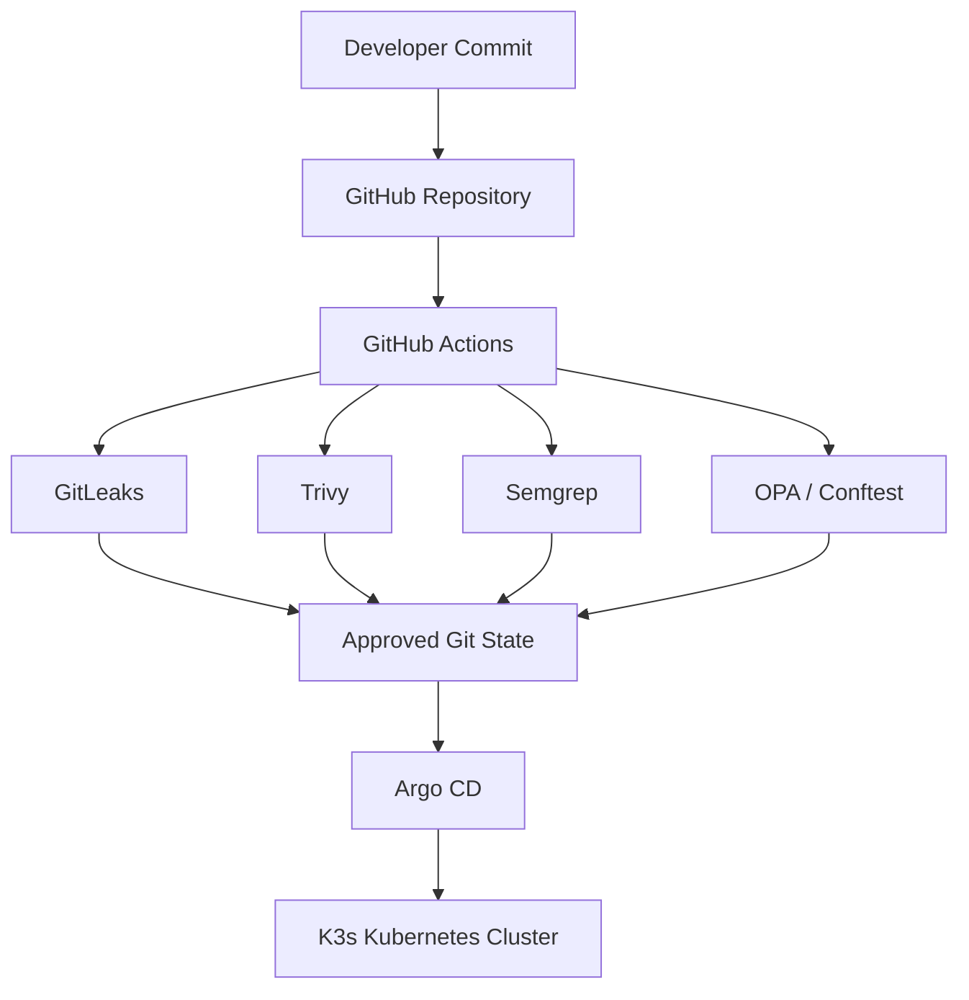

# Secure GitOps Lab

## Secure GitOps: Integrating DevSecOps Security Controls into a GitOps-Based CI/CD Pipeline on Kubernetes

This repository contains the implementation used to evaluate a **Secure GitOps pipeline** on Kubernetes. The solution combines GitHub Actions security checks with OPA/Conftest policy enforcement and a separate K3s + Argo CD GitOps deployment environment.

The implementation compares three pipeline configurations so that the effect of additional security controls can be observed without changing the underlying repository workflow.

## Implemented Architecture

The lab uses the following components:

- **GitHub Actions** – CI workflow execution
- **GitLeaks** – repository secret detection
- **Trivy** – Kubernetes/configuration scanning
- **Semgrep** – static application security testing
- **OPA + Conftest** – Kubernetes policy enforcement
- **K3s** – lightweight Kubernetes cluster
- **Argo CD** – GitOps continuous delivery and reconciliation
- **VirtualBox Ubuntu Server VM** – local Kubernetes host

The intended flow is:



## Repository Structure

```text
secure-gitops-lab/
├── .github/
│   └── workflows/
│       ├── app/
│       │   └── vulnerable_db.py
│       ├── config/
│       │   └── secrets.py
│       ├── Dockerfile
│       ├── pipeline-a-baseline.yaml
│       ├── pipeline-b-standard.yaml
│       └── pipeline-c-full-secure.yaml
├── k8s/
│   └── bad-deployment.yaml
├── policy/
│   └── nis2_compliance.rego
├── deployment.yaml
└── README.md
```

The files under `app/`, `config/` and the workflow Dockerfile provide controlled security test inputs. They are used only for the isolated lab experiment.

## Pipeline Configurations

### Pipeline A – GitOps Baseline

File: `.github/workflows/pipeline-a-baseline.yaml`

Pipeline A represents the baseline configuration. It:

1. checks out the repository;
2. verifies that `deployment.yaml` exists; and
3. completes without running security scanners.

This provides the lowest-overhead reference pipeline.

### Pipeline B – Standard DevSecOps

File: `.github/workflows/pipeline-b-standard.yaml`

Pipeline B adds:

- **GitLeaks** for secret detection; and
- **Trivy** with `scan-type: config` for HIGH and CRITICAL configuration findings.

The supplied Pipeline B workflow does **not** contain a Semgrep step.

### Pipeline C – Full Secure GitOps and NIS2 Gate

File: `.github/workflows/pipeline-c-full-secure.yaml`

Pipeline C contains the complete security sequence used in the repository:

1. GitLeaks secret scanning;
2. Trivy configuration scanning;
3. Semgrep SAST analysis; and
4. Conftest validation using OPA Rego policies.

Trivy and Semgrep are configured with `continue-on-error: true`, so their findings are recorded without immediately stopping the job. The final **Conftest/OPA policy stage acts as the explicit Kubernetes policy gate**.

All workflows are triggered on pushes and pull requests to the `main` branch.

## OPA / Conftest Security Policy

The policy is stored in:

```text
policy/nis2_compliance.rego
```

The implementation enforces three Kubernetes deployment rules mapped to NIS2 Article 21 technical requirements:

1. **Privileged containers are prohibited.**
2. **Deployments must explicitly set `securityContext.runAsNonRoot: true`.**
3. **Container images must not use the mutable `:latest` tag.**

---

### Manifest Files

Two Kubernetes manifest files are provided in the `k8s/` directory to support the controlled experiment:

#### bad-deployment-original.yaml — Non-Compliant (Experiment Input)

This is the intentionally non-compliant manifest used as the controlled vulnerability input during the experiment. It violates all three OPA/Conftest rules and causes Pipeline C to fail at the Conftest policy gate:

| Rule | Setting | Violation |
|---|---|---|
| Rule 1 — No privileged containers | `privileged: true` |  Fails |
| Rule 2 — Must run as non-root | `runAsNonRoot` not set |  Fails |
| Rule 3 — No mutable image tags | `image: nginx:latest` |  Fails |

```yaml
# Intentionally non-compliant — for experiment use only
apiVersion: apps/v1
kind: Deployment
metadata:
  name: non-compliant-workload
  labels:
    app: myapp
spec:
  replicas: 1
  selector:
    matchLabels:
      app: myapp
  template:
    metadata:
      labels:
        app: myapp
    spec:
      containers:
      - name: app
        image: nginx:latest
        securityContext:
          privileged: true
          allowPrivilegeEscalation: true
```

#### bad-deployment.yaml — Remediated (Secure State)

This is the remediated version produced after applying the required security fixes. It passes all three OPA rules and represents the secure desired state that ArgoCD synchronises to the K3s cluster:

| Rule | Setting | Result |
|---|---|---|
| Rule 1 — No privileged containers | `privileged: false` | Passes |
| Rule 2 — Must run as non-root | `runAsNonRoot: true` | Passes |
| Rule 3 — No mutable image tags | `image: nginx:1.25.3` | Passes |

```yaml
securityContext:
  runAsNonRoot: true
  runAsUser: 10001
```

```yaml
image: nginx:1.25.3
securityContext:
  privileged: false
  allowPrivilegeEscalation: false
```

---

### Running the Policy Validation

To validate both manifests locally with Conftest:

```bash
# Test the non-compliant manifest — expect 3 violations
conftest test k8s/bad-deployment-original.yaml --policy policy

# Test the remediated manifest — expect 0 violations
conftest test k8s/bad-deployment.yaml --policy policy

# Test the entire k8s directory
conftest test k8s --policy policy
```

Expected output for the non-compliant manifest:

```text
FAIL - k8s/bad-deployment-original.yaml - main - NIS2 violation: 
       Container must not run in privileged mode
FAIL - k8s/bad-deployment-original.yaml - main - NIS2 violation: 
       Container must not run as root user
FAIL - k8s/bad-deployment-original.yaml - main - NIS2 violation: 
       Container image must use a specific version tag

3 tests, 0 passed, 0 warnings, 3 failures
```

Expected output for the remediated manifest:

```text
1 test, 1 passed, 0 warnings, 0 failures
```

A policy violation returns a non-zero exit code and prevents Pipeline C from passing the final Conftest policy gate, blocking ArgoCD synchronisation of the non-compliant state.

## Lab Environment

The implementation was tested in the following local environment:

| Component | Configuration |
|---|---|
| Virtualisation | Oracle VirtualBox |
| Guest OS | Ubuntu Server |
| CPU | 2 vCPUs |
| RAM | 3 GB |
| Networking | NAT |
| Port forwarding | Host `8081` → Guest `8081` |
| Kubernetes | K3s `v1.36.2+k3s1` |
| Argo CD | `v3.4.5` |

The supplied `.vbox` file contains the VM configuration, but the original VDI/snapshot disks are not included. A new Ubuntu Server VM can therefore be created using the settings above.

## K3s Setup

Install the K3s version used in the lab:

```bash
curl -sfL https://get.k3s.io | INSTALL_K3S_VERSION=v1.36.2+k3s1 sh -
```

Verify the cluster:

```bash
sudo kubectl get nodes -o wide
sudo kubectl get pods -A
```

The node should report `Ready` before deploying workloads or configuring Argo CD.

## Argo CD Setup

Create the namespace and install Argo CD 3.4.5:

```bash
sudo kubectl create namespace argocd
sudo kubectl apply -n argocd \
  -f https://raw.githubusercontent.com/argoproj/argo-cd/v3.4.5/manifests/install.yaml
```

Expose the Argo CD server through the VM port used in the lab:

```bash
sudo kubectl -n argocd port-forward \
  --address=0.0.0.0 svc/argocd-server 8081:443
```

With the VirtualBox NAT rule enabled, the dashboard can be accessed from the host at:

```text
https://localhost:8081
```

The implementation evidence uses the Argo CD example Guestbook application from:

```text
https://github.com/argoproj/argocd-example-apps.git
```

with the source path `guestbook` and destination namespace `default`.

## Running the CI Experiment

1. Push the repository to GitHub.
2. Keep the workflow files under `.github/workflows/`.
3. Push or open a pull request against `main`.
4. Compare Pipeline A, B and C in the **Actions** tab.
5. Review scanner findings and the Conftest result.
6. After the repository state passes the required security checks, verify the corresponding application state in Argo CD and Kubernetes.

The root deployment can also be tested manually:

```bash
sudo kubectl apply -f deployment.yaml
sudo kubectl get deployments
sudo kubectl get pods -o wide
```

## Controlled Policy Failure Test

The thesis experiment also tested a deliberately non-compliant Kubernetes state. To reproduce that behaviour in the isolated lab, temporarily introduce one or more of the following into `k8s/bad-deployment.yaml`:

- `privileged: true`
- remove or disable `runAsNonRoot: true`
- change the image to `nginx:latest`

Pipeline C should fail at the Conftest/OPA stage. Restore the supplied secure values and rerun the workflow to confirm successful remediation.

## Key Results from the Implementation

The experimental evaluation reported that the complete Secure GitOps configuration achieved the strongest security coverage, with a reported vulnerability detection rate of up to **95%**, a false-positive rate below **8%**, and approximately **30–53 seconds** of additional pipeline execution time compared with the baseline configuration.

These figures are thesis experiment results. The raw benchmark dataset is not included in this repository, so they should not be treated as values that can be recalculated from the uploaded files alone.

## Implementation Notes

A few boundaries are important when reproducing the project:

- Pipeline B in the supplied repository contains **GitLeaks and Trivy only**.
- Trivy is configured for **configuration scanning**, not a container-image CVE scan.
- Pipeline C contains Semgrep and OPA/Conftest in addition to the Standard controls.
- The supplied OPA policy contains exactly **three** enforcement rules described above.
- Terraform, FastAPI and PostgreSQL are discussed in the thesis, but their implementation files are not present in the uploaded repository snapshot.
- The captured Argo CD Guestbook deployment uses the external `argocd-example-apps` repository rather than an Argo CD `Application` manifest stored in this repository.

## Project Purpose

This study demonstrates how security validation can be placed before Kubernetes GitOps reconciliation. The baseline pipeline provides delivery automation with no security scanning, while the Standard and Full configurations progressively add security controls. The final architecture shows how repository scanning, source analysis, configuration scanning and Policy-as-Code can be combined to reduce the chance of an insecure Kubernetes configuration progressing through an automated delivery workflow.
